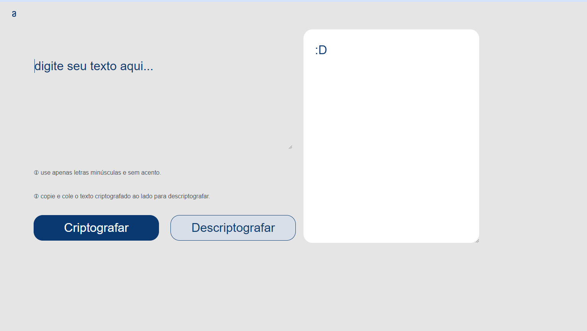

# Challenge Alura | Oracle One | Decodificador de texto

Sobre o Projeto
---
Resultado do primeiro desafio do programa ONE, da Oracle em parceria com a Alura:
- Decodificador de texto com design responsivo feito em HTML, CSS e JavaScript.

     

Essa é uma aplicação que criptografa textos, assim você poderá trocar mensagens secretas com outras pessoas que saibam o segredo da criptografia utilizada.

Chave de Criptografia
---

As "chaves" de criptografia utilizadas são: 
- A letra "e" é convertida para "enter" 
- A letra "i" é convertida para "imes" 
- A letra "a" é convertida para "ai" 
- A letra "o" é convertida para "ober" 
- A letra "u" é convertida para "ufat" 

Requisitos:
---
- Deve funcionar apenas com letras minúsculas.
- Não devem ser utilizados letras com acentos nem caracteres especiais.
- Deve ser possível converter uma palavra para a versão criptografada e também retornar uma palavra criptografada para a versão original.

Por exemplo:
"gato" => "gaitober"
gaitober" => "gato"

- A página deve ter campos para inserção do texto a ser criptografado ou descriptografado, e a pessoa usuária deve poder escolher entre as duas opções.

- O resultado deve ser exibido na tela.